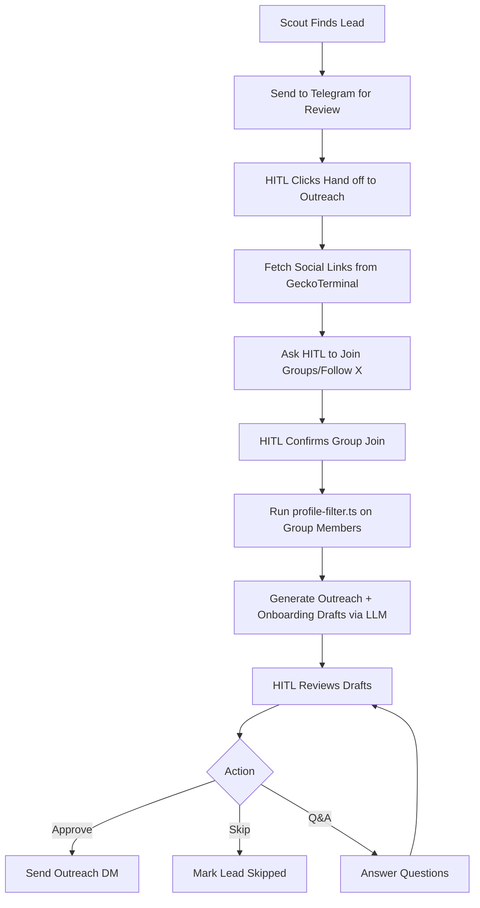

# Lead Handoff to Outreach Workflow Plan

## Overview

When leads are provided after using Scout on the website, the system should:

1. Send lead info to Telegram when HITL clicks "Hand off to Outreach"
2. Fetch project social links from GeckoTerminal
3. Ask HITL to join groups/channels and follow X accounts
4. After confirmation, use profile-filter.ts to filter target audience
5. Use LLM to generate outreach and onboarding drafts
6. Allow HITL to approve, skip, or request Q&A

## Current State Analysis

### Existing Components

- [`src/lib/autonomy/orchestrator.ts`](src/lib/autonomy/orchestrator.ts) - Main event handler with HITL callback support
- [`src/lib/autonomy/lead-enrichment-handler.ts`](src/lib/autonomy/lead-enrichment-handler.ts) - Enrichment state management
- [`src/lib/autonomy/geckoterminal-enrich.ts`](src/lib/autonomy/geckoterminal-enrich.ts) - Social links fetching
- [`src/lib/autonomy/profile-filter-runner.ts`](src/lib/autonomy/profile-filter-runner.ts) - Profile filtering
- [`src/lib/autonomy/draft-generator.ts`](src/lib/autonomy/draft-generator.ts) - LLM draft generation
- [`src/lib/autonomy/qa-handler.ts`](src/lib/autonomy/qa-handler.ts) - Q&A support
- [`src/lib/autonomy/telegram-client.ts`](src/lib/autonomy/telegram-client.ts) - Telegram messaging
- [`src/lib/autonomy/notifications.ts`](src/lib/autonomy/notifications.ts) - Lead review cards

### Current Flow

1. Scout finds leads → `sendLeadForReview()` sends to Telegram with approve/skip/discard buttons
2. HITL clicks "approve" → auto-DM is sent (no enrichment workflow)
3. Enrichment workflow exists but is triggered differently

## Proposed Workflow



## Implementation Steps

### 1. Update `notifications.ts` - Add "Hand off to Outreach" Button

**File:** [`src/lib/autonomy/notifications.ts`](src/lib/autonomy/notifications.ts)

Change the `sendLeadForReview` function to include a "Hand off to Outreach" button instead of "Approve & DM":

```typescript
// Current buttons:
[
  { text: '✅ Approve & DM', callback_data: encodeCallback('approve', lead.id) },
  { text: '⏭️ Skip', callback_data: encodeCallback('skip', lead.id) },
  { text: '❌ Discard', callback_data: encodeCallback('discard', lead.id) },
]

// New buttons:
[
  { text: '🤝 Hand off to Outreach', callback_data: `enrich_handoff_${lead.id}` },
  { text: '⏭️ Skip', callback_data: encodeCallback('skip', lead.id) },
  { text: '❌ Discard', callback_data: encodeCallback('discard', lead.id) },
]
```

### 2. Update `orchestrator.ts` - Handle Enrichment Handoff

**File:** [`src/lib/autonomy/orchestrator.ts`](src/lib/autonomy/orchestrator.ts)

Add handler for `enrich_handoff` action in `handleHITLCallback`:

```typescript
// Add new case for enrichment handoff
if (action === "enrich_handoff") {
  // Start enrichment workflow
  const { enrichWithSocialLinks } = await import("./lead-enrichment-handler");
  const { formatGroupJoinRequest } = await import("./lead-enrichment-handler");
  const { sendGroupJoinRequest } = await import("./telegram-client");

  // Fetch social links
  const context = await enrichWithSocialLinks(
    leadId,
    lead.project_name,
    lead.contract_address,
    lead.chain,
  );

  // Format and send group join request
  const message = await formatGroupJoinRequest(
    context,
    process.env.TELEGRAM_CHAT_ID!,
  );
  await sendGroupJoinRequest(leadId, lead.project_name, message);

  return { ok: true, responseText: "Starting enrichment workflow..." };
}
```

### 3. Update `lead-enrichment-handler.ts` - Support Scout Lead Handoff

**File:** [`src/lib/autonomy/lead-enrichment-handler.ts`](src/lib/autonomy/lead-enrichment-handler.ts)

The current `enrichWithSocialLinks` function needs to:

- Accept lead data from Scout (may not have contract_address)
- Handle cases where GeckoTerminal doesn't return social links
- Store the lead context for later use

### 4. Update `telegram-client.ts` - Add Enrichment Messages

**File:** [`src/lib/autonomy/telegram-client.ts`](src/lib/autonomy/telegram-client.ts)

The `sendGroupJoinRequest` function already exists. May need to enhance to:

- Include X account follow instructions
- Show social links in a clearer format
- Add "I don't have access" option for private groups

### 5. Update `profile-filter-runner.ts` - Integration

**File:** [`src/lib/autonomy/profile-filter-runner.ts`](src/lib/autonomy/profile-filter-runner.ts)

The `runProfileFilter` function exists. Need to:

- Accept empty profiles array (HITL will provide members manually or via bot)
- Handle the case where Telegram API access is limited

### 6. Update `draft-generator.ts` - Integration

**File:** [`src/lib/autonomy/draft-generator.ts`](src/lib/autonomy/draft-generator.ts)

The `generateFullDraft` function exists. Need to:

- Accept target audience data from profile filter
- Generate both outreach and onboarding messages

### 7. Add Q&A Support

**File:** [`src/lib/autonomy/qa-handler.ts`](src/lib/autonomy/qa-handler.ts)

Add a "❓ Ask Question" button to the draft review card that:

- Opens a Q&A session with the LLM
- Provides context about the lead and target audience

## Key Changes Summary

| File                         | Change                                                    |
| ---------------------------- | --------------------------------------------------------- |
| `notifications.ts`           | Replace "Approve & DM" with "Hand off to Outreach" button |
| `orchestrator.ts`            | Add `enrich_handoff` case in `handleHITLCallback`         |
| `lead-enrichment-handler.ts` | Enhance to work with Scout lead data                      |
| `telegram-client.ts`         | Add X follow instructions to group join message           |
| `profile-filter-runner.ts`   | Handle empty profiles gracefully                          |
| `draft-generator.ts`         | Connect to profile filter output                          |

## Testing Scenarios

1. **Happy Path**: Lead with contract address → social links found → HITL joins → profiles filtered → drafts generated → approved
2. **No Social Links**: Lead without contract address → manual entry option
3. **Private Group**: HITL can't join → skip option
4. **Q&A Flow**: HITL asks questions about target audience → gets answers
5. **Skip Lead**: HITL skips during any step

## Questions for Clarification

1. Should the "Hand off to Outreach" button replace the current "Approve & DM" button, or be an additional option?
2. For projects without contract addresses, should we allow manual entry of social links?
3. How should we handle the Telegram group member fetching? (Bot access, manual input, or mock data?)
4. Should the Q&A be a separate button or integrated into the draft review?
